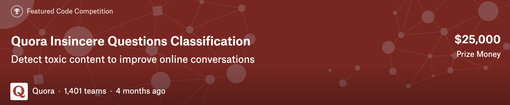

# Quora Insincere Questions Classification

Two tutorial solutions to solve the <a href="https://www.kaggle.com/c/quora-insincere-questions-classification"> Kaggle competition</a>: **Quora Insincere Questions Classification**

Both are implemented in PyTorch.

- Solution n°1:
  A toy neural network composed of an embedding layer and a concatenation of a max pooling and an average pooling layer

- Solution n°2:

  A more sophisticated model that achieves better validation F1 score (see end of the notebook)
  
  Improvements include:

  - Advanced text processing and cleaning
  - A custom tokenizer based on Spacy and its english language model
  - A FastText binary model to initialize an embedding matrix from character-ngrams (i.e. no out-of-vocabulary words)
  - A stacked bi-LSTM architecture
